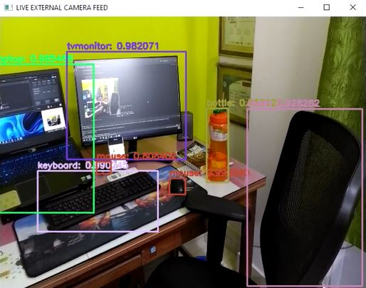

<!-- PROJECT LOGO -->
<br />
<p align="center">
  <a href="https://github.com/RAJ-DSML/Real_Time_Object_Detecion_using_YOLOv3/blob/main/live_detection.JPG">
    
  </a>

  <h1 align="center">Real Time Object Detection using YOLOv3</h1>
</p>


<!-- TABLE OF CONTENTS -->
<details open="open">
  <summary>Table of Contents</summary>
  <ol>
    <li>
      <a href="#about-the-project">About The Project</a>
      <ul>
        <li><a href="#built-with">Built With</a></li>
      </ul>
    </li>
    <li>
      <a href="#getting-started">Getting Started</a>
      <ul>
        <li><a href="#prerequisites">Prerequisites</a></li>
      </ul>
    </li>
    <li><a href="#usage">Usage</a></li>
  </ol>
</details>


<!-- ABOUT THE PROJECT -->
## About The Project

Object detection is one of the dynamic research directions for computer vision. Object detection is a technique that detects the semantic objects of a particular class in digital images, recorded videos or live camera feeds. If I talking about real-time applications, that is nothing but self-driving cars or even an application for the visually impaired that detects and notifies the disabled person that some object is in front of them. YOLO ("you only look once") is one of the popular algorithms because it achieves high accuracy along with being able to run in real-time. The algorithm "only looks once" at the image, i.e. it requires only one forward propagation pass through the network so that it can make predictions. After non-max suppression, it gives the name of the recognized object along with the bounding boxes around them.

### Built With

* [NumPy](https://opencv.org/)
* [OpenCV](https://numpy.org/)

### Prerequisites

You need to install following python packages along with PyCharm IDE.

* numpy
  ```sh
  pip install numpy
  ```
* openCV
  ```sh
  pip install opencv-python
  ```

<!-- USAGE EXAMPLES -->
## Usage

* Automated CCTV surveillance

Surveillance is a necessary piece of security and watch. Ongoing advances in computer vision innovation need to prompt the improvement of different programmed surveillance systems. 

* Person Detection

Person detection is necessary and critical work in any intelligent video surveillance framework, as it gives the essential data to semantic comprehension of the video recordings. It has a conspicuous augmentation to automotive applications because of the potential for improving security frameworks.


## 📱 Contact

Badge | URL
------------ | -------------
 | `https://www.linkedin.com/in/raj-kumar-pal-280895159/`
